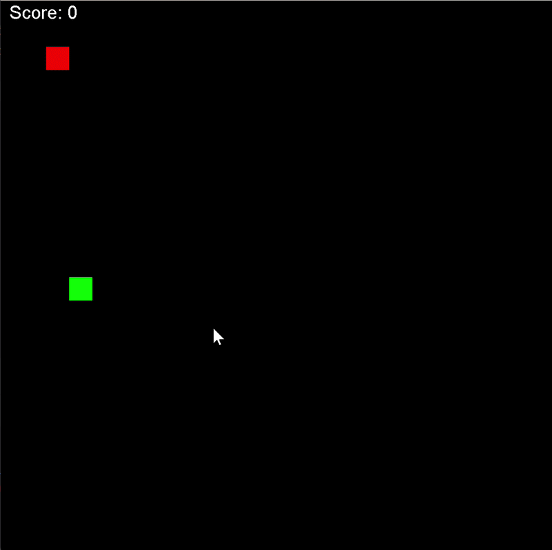

# 🐍 Snake Game - Java Swing

A classic implementation of the Snake game built using **pure Java** and the **Swing** library. This project demonstrates core game development concepts such as game loops, keyboard event handling, and 2D graphics rendering.

## 🚀 How to Run

### Option 1: Using the JAR file (Fastest)
If you just want to play, download the `Snake.jar` file from this repository and run it via terminal or double-click it:
```bash
java -jar Snake.jar
```

### Option 2: Running from source
If you want to build and run the project manually from your terminal:
1. Compile the source code:
```bash
#ensure you are in the project folder
mkdir out
javac -d out src/*.java
```

2. Launch the game:
```bash
#ensure you are in the project folder
java -cp out SnakeGame
```
## ꔮ Steering
To control the snake, simply use the arrow keys.

## 🐍 Game snippet
